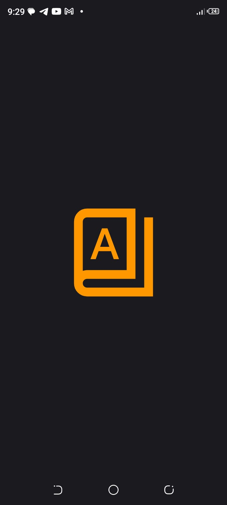
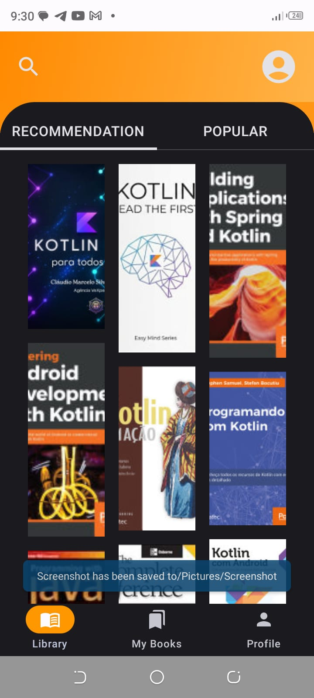
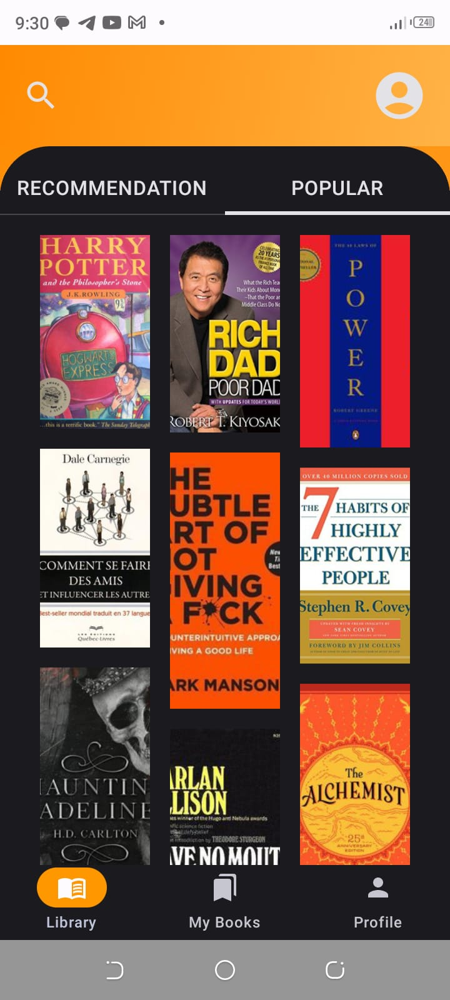
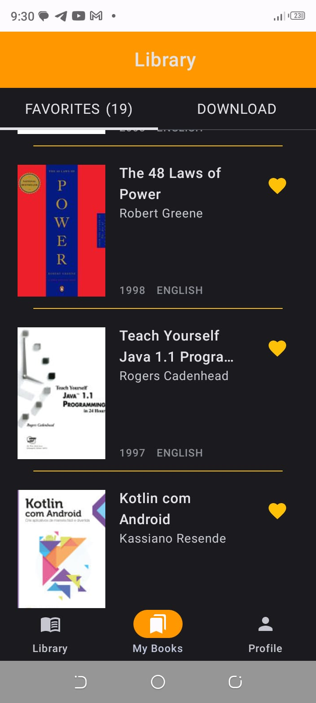
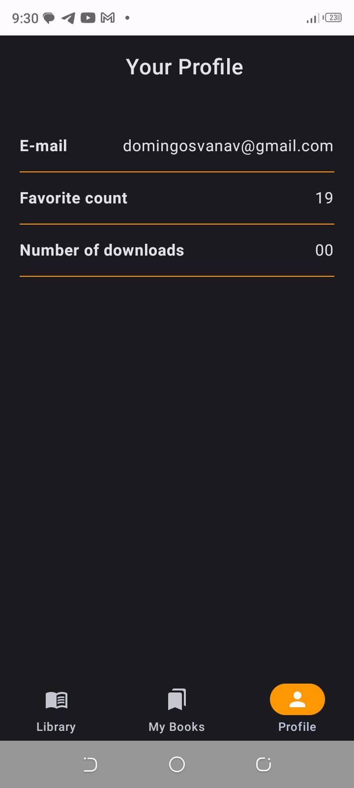
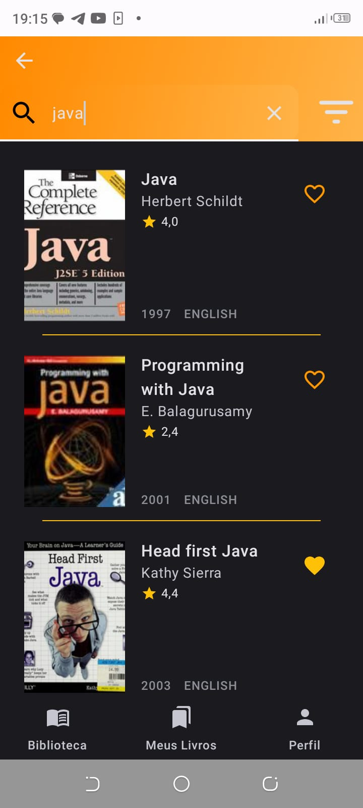
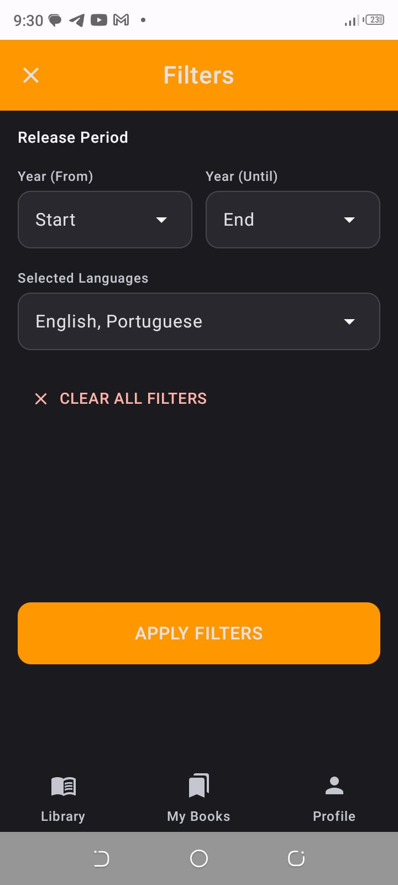
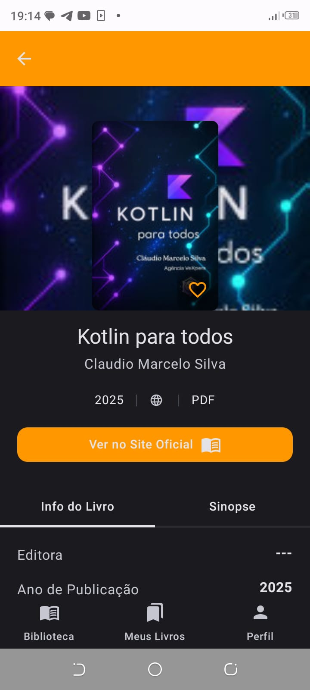

# 📚 Book Reader Free - Multisource E-reader (Work in Progress)

A comprehensive Android application designed to centralize access to global digital libraries.

The app enables users to discover, search, and favorite books from multiple providers such as **Google Books, OpenLibrary, and Gutendex**, providing direct access to these platforms for the full reading experience.

This project is currently in progress and continuously evolving.

---

## ✨ Features

- Search books from multiple sources
- Favorite books for quick access
- Integration with global digital libraries
- Bilingual support (English / Portuguese)
- Responsive and modern UI
- Google Authentication (Firebase)
- Offline caching of books and results

---

## 🛠 Tech Stack

- Kotlin
- Jetpack Compose
- MVVM Architecture
- Ktor (Networking)
- Room (Local Database & Caching)
- Koin (Dependency Injection)
- Firebase Authentication (Google Sign-In)
- Navigation Compose
- Material 3

---

## 🧠 Technical Highlights

- **Multisource API Integration**: Fetching and combining data from multiple book providers
- **Offline Support**: Caching search results, popular books, and recommendations using Room
- **Clean Architecture (MVVM)**: Separation of concerns for scalability and maintainability
- **Dependency Injection with Koin**: Decoupled and testable codebase
- **Dynamic UI**: Built with Jetpack Compose for modern Android development

---

## 📸 Screenshots

  
  
  

  
  

  
  
  

---

## 🎥 App Demo

  

---

## 📚 Lessons Learned

- Integrating multiple APIs into a single application
- Managing asynchronous requests with Ktor
- Implementing local caching with Room
- Structuring scalable Android apps using MVVM
- Handling authentication with Firebase (Google Sign-In)
- Building responsive UIs with Jetpack Compose
- Improving problem-solving and debugging skills

---

## 🚀 Future Improvements

- Improve recommendation system
- Add advanced filtering options
- Enhance offline-first experience
- Add unit and UI testing
- Improve UI/UX design
- Add audiobook support (future idea)

---

## 💡 Developer Journey

Building this project from scratch was a challenging journey.

Like every developer, I faced significant challenges that pushed me to improve my technical skills and logical reasoning. Implementing features like **Google Authentication** for the first time was particularly complex, but overcoming these difficulties helped me grow.

I also leveraged AI tools to refine the UI, aiming for a more elegant and professional interface.

I am committed to continuously improving both this system and my development skills.

---

## 🤝 Contribution

Contributions are welcome.

If you are interested in contributing, please contact me first to discuss your ideas and ensure alignment with the project direction.

Feel free to fork the repository, suggest improvements, or submit a pull request while maintaining clean and well-structured code.
---

## 📄 License

This project is open-source and intended for educational and learning purposes.